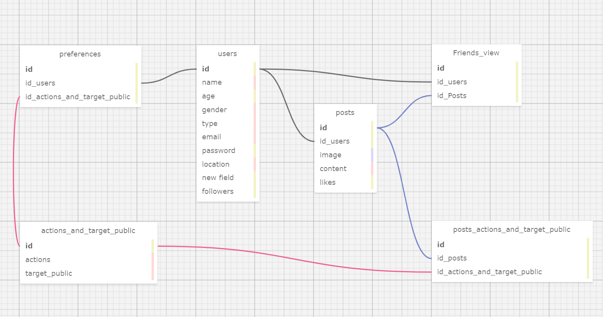

# Ponderada Banco De Dados _ Kaio

Banco de dados:

  
Código SQL
  
-- Globals
-- ---

-- SET SQL_MODE="NO_AUTO_VALUE_ON_ZERO";
-- SET FOREIGN_KEY_CHECKS=0;

-- ---
-- Table 'users'
-- 
-- ---

DROP TABLE IF EXISTS users;
		
CREATE TABLE users (
  id SERIAL PRIMARY KEY,
  name VARCHAR(50),
  age INT,
  gender VARCHAR(20),
  type BYTEA,
  email VARCHAR,
  password INT,
  location VARCHAR(50),
  "new field" INTEGER,
  followers INT
);

-- ---
-- Table 'posts'
-- 
-- ---

DROP TABLE IF EXISTS posts;
		
CREATE TABLE posts (
  id SERIAL PRIMARY KEY,
  id_users INT,
  image BYTEA,
  content VARCHAR(400),
  likes INTEGER
);

-- ---
-- Table 'preferences'
-- 
-- ---

DROP TABLE IF EXISTS preferences;
		
CREATE TABLE preferences (
  id SERIAL PRIMARY KEY,
  id_users INT,
  id_actions_and_target_public INT
);

-- ---
-- Table 'actions_and_target_public'
-- 
-- ---

DROP TABLE IF EXISTS actions_and_target_public;
		
CREATE TABLE actions_and_target_public (
  id SERIAL PRIMARY KEY,
  actions VARCHAR(20),
  target_public VARCHAR(20)
);

-- ---
-- Table 'posts_actions_and_target_public'
-- 
-- ---

DROP TABLE IF EXISTS posts_actions_and_target_public;
		
CREATE TABLE posts_actions_and_target_public (
  id SERIAL PRIMARY KEY,
  id_posts INT,
  id_actions_and_target_public INT
);

-- ---
-- Table 'Friends_view'
-- 
-- ---

DROP TABLE IF EXISTS Friends_view;
		
CREATE TABLE Friends_view (
  id SERIAL PRIMARY KEY,
  id_users INT,
  id_Posts INT
);

-- ---
-- Foreign Keys 
-- ---

ALTER TABLE posts ADD CONSTRAINT fk_posts_users FOREIGN KEY (id_users) REFERENCES users (id);
ALTER TABLE preferences ADD CONSTRAINT fk_preferences_users FOREIGN KEY (id_users) REFERENCES users (id);
ALTER TABLE preferences ADD CONSTRAINT fk_preferences_actions_and_target_public FOREIGN KEY (id_actions_and_target_public) REFERENCES actions_and_target_public (id);
ALTER TABLE posts_actions_and_target_public ADD CONSTRAINT fk_posts_actions_and_target_public_posts FOREIGN KEY (id_posts) REFERENCES posts (id);
ALTER TABLE posts_actions_and_target_public ADD CONSTRAINT fk_posts_actions_and_target_public_actions_and_target_public FOREIGN KEY (id_actions_and_target_public) REFERENCES actions_and_target_public (id);
ALTER TABLE Friends_view ADD CONSTRAINT fk_Friends_view_users FOREIGN KEY (id_users) REFERENCES users (id);
ALTER TABLE Friends_view ADD CONSTRAINT fk_Friends_view_posts FOREIGN KEY (id_Posts) REFERENCES posts (id);

-- ---
-- Test Data
-- ---

-- INSERT INTO users (name, age, gender, type, email, password, location, "new field", followers) VALUES
-- ('', NULL, NULL, NULL, NULL, NULL, NULL, NULL, NULL);
-- INSERT INTO posts (id_users, image, content, likes) VALUES
-- (NULL, NULL, NULL, NULL);
-- INSERT INTO preferences (id_users, id_actions_and_target_public) VALUES
-- (NULL, NULL);
-- INSERT INTO actions_and_target_public (actions, target_public) VALUES
-- (NULL, NULL);
-- INSERT INTO posts_actions_and_target_public (id_posts, id_actions_and_target_public) VALUES
-- (NULL, NULL);
-- INSERT INTO Friends_view (id_users, id_Posts) VALUES
-- (NULL, NULL);